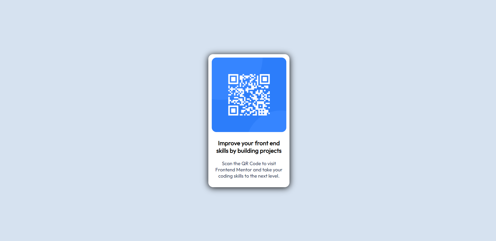

# Frontend Mentor - QR code component solution

This is a solution to the [QR code component challenge on Frontend Mentor](https://www.frontendmentor.io/challenges/qr-code-component-iux_sIO_H).
## Table of contents

- [Overview](#overview)
  - [Screenshot](#screenshot)
  - [Links](#links)
- [My process](#my-process)
  - [Built with](#built-with)
  - [What I learned](#what-i-learned)
  - [Useful resources](#useful-resources)
- [Author](#author)

## Overview
This is a  project to just implement some basic HTML and CSS Knowledge.

### Screenshot

### Links

- Live Site URL: (https://mohit834.github.io/Qr-code-project-using-CSS-and-HTML/)

## My process

- I first started with the basic layout using HTML
- then I jumped into the designing part.
- I got stuck when the page when opened in mobile was not what I wanted So, I had to go through some articles and I learned a new thing.

### Built with

- Semantic HTML5 markup
- CSS custom properties

### What I learned

I learned the way to design the website by keeping android view also in mind.

### Useful resources

stack Overflow helped me when is was stuck.

## Author

- Website -  [Mohit](https://mohit834.github.io/Qr-code-project-using-CSS-and-HTML/)
- Frontend Mentor - [Mohit Kumar](https://www.frontendmentor.io/profile/mohit834)

